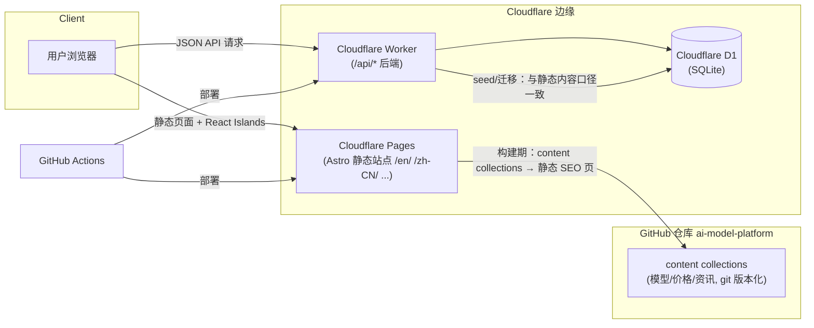

# Architecture

AI Model Intelligence Platform — 免费、开放、全球化的 AI 模型情报平台。

## 1. 产品目标

| 能力 | 说明 |
| --- | --- |
| 模型信息查询 | 多供应商模型目录（能力、上下文窗口、知识截止等） |
| 价格对比 | 各供应商 input/output 每百万 Token 单价对比 |
| Token 计数 | 文本 Token 数量计算（可插拔 tokenizer） |
| 成本估算 | 基于用量与价格的 API 调用成本估算 |
| AI 行业资讯 | 多语言资讯聚合 |

产品红线：**免费、开放、全球化、SEO 友好、数据透明**；无商业化、无广告、无付费功能。

## 2. 技术栈

- **前端**：Astro 7（SSG 优先）+ React Islands + TypeScript（strict）+ Tailwind CSS v4
- **后端**：Cloudflare Workers（TypeScript）
- **数据库**：Cloudflare D1（SQLite）
- **部署**：GitHub（源码）+ Cloudflare Pages（站点）+ Cloudflare Workers（API）
- **包管理**：pnpm workspace（monorepo）

## 3. 系统架构



## 4. 组件职责

### 4.1 frontend/（Astro）

- **页面层**：`src/pages/[lang]/...`，i18n 路由（7 语言前缀），SSG 输出静态页（SEO 优先）。
- **内容层**：`src/content/` content collections（zod schema 强校验），模型/价格/资讯数据源（Phase 2+ 落地）。
- **交互层**：React Islands（Token 计数、成本估算等客户端交互组件）。
- **i18n 层**：`src/i18n/`（locales.ts 单一来源 + ui.ts 字典），文案不散落组件。
- **共享层**：`src/lib/`（tokenizer、成本计算、格式化等纯逻辑）。

### 4.2 worker/（Cloudflare Workers）

- `src/index.ts`：入口路由（当前仅健康检查），后续按 `/api/*` 扩展：models、pricing、token-count、cost-estimate。
- `wrangler.toml`：D1 绑定（`DB`），部署配置。
- 与前端共享类型与常量（`shared/` 或 pnpm workspace 依赖，Phase 5 落地）。

### 4.3 database/（Cloudflare D1）

- `schema/schema.sql`：全量 DDL（Phase 5 落地）。
- 设计文档：`docs/database-design.md`。

### 4.4 docs/

- 架构 / 路线图 / 数据库设计。

## 5. 关键设计决策（ADR 摘要）

| # | 决策 | 理由 | 状态 |
| --- | --- | --- | --- |
| ADR-001 | Astro 官方 i18n 路由，`prefixDefaultLocale: true` | URL 结构 `/en/ /zh-CN/ ...` 与需求一致；hreflang/sitemap 原生支持 | ✅ Phase 1 |
| ADR-002 | 双层数据：静态内容 collections + 动态 Workers/D1 | SEO 静态页（免费、快、可收录）+ 运行时 API（可扩展）；数据在 git 中透明可审查 | 计划 Phase 2/5 |
| ADR-003 | 可插拔 tokenizer 注册表（js-tiktoken 等按模型映射，未知回退启发式） | 多供应商 tokenizer 各异，需按模型精确计数并可扩展 | 计划 Phase 4 |
| ADR-004 | 统一价格模型：input/output 每 1M tokens + 多级定价（标准/batch/缓存） | 成本估算与对比的基础，支持未来定价类型扩展 | 计划 Phase 5 |
| ADR-005 | SSG 优先 + JSON-LD + OG/canonical + sitemap | 全球化 SEO 是核心产品理念 | 计划 Phase 3+ |

## 6. 目录结构

```
ai-model-platform/
├── frontend/          # Astro 站点
│   ├── src/
│   │   ├── components/  # React Islands / Astro 组件
│   │   ├── i18n/        # 语言与文案字典
│   │   ├── layouts/     # 布局
│   │   ├── lib/         # 纯逻辑（tokenizer、成本计算等）
│   │   ├── pages/       # [lang] 路由页面
│   │   └── styles/      # 全局样式（Tailwind v4）
│   ├── astro.config.ts
│   └── tsconfig.json
├── worker/            # Cloudflare Workers API
│   ├── src/index.ts
│   └── wrangler.toml
├── database/          # Cloudflare D1 schema
│   └── schema/
├── docs/              # 架构 / 路线图 / 数据库设计
└── package.json       # pnpm workspace 根
```

## 7. 本地开发

```bash
pnpm install
pnpm dev                  # frontend dev server (http://localhost:4321)
pnpm --filter worker dev  # worker 本地开发（wrangler dev）
pnpm check                # 前端类型检查（astro check）
pnpm build                # 前端生产构建
```

详见 [roadmap.md](./roadmap.md) 的阶段安排。
