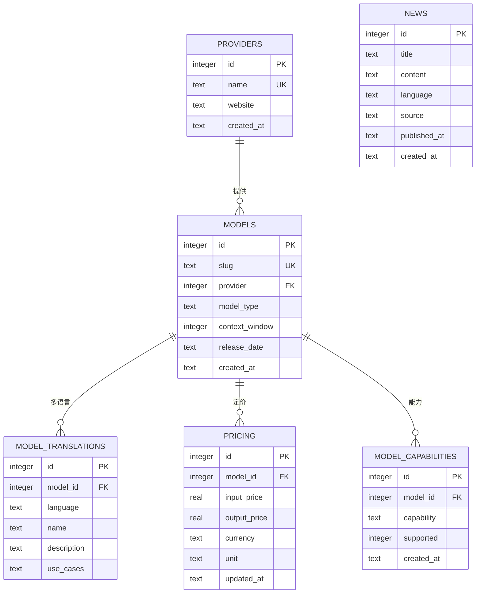

# Database Design — Cloudflare D1 (SQLite)

AI Model Intelligence Platform 的数据模型设计。**v1 落地版**已随 Phase 3 在 `database/schema/schema.sql` 与 `database/migrations/0001_init.sql` 落地；本文件为设计基线文档。

## 1. v1 表结构（Phase 3 落地）

## 2. 字段说明

### providers — 供应商

| 字段 | 类型 | 说明 |
| --- | --- | --- |
| id | INTEGER PK | 自增主键 |
| name | TEXT UK | 供应商名（如 OpenAI） |
| website | TEXT | 官网 |
| created_at | TEXT | ISO 8601 UTC 时间戳 |

### models — 模型目录

| 字段 | 类型 | 说明 |
| --- | --- | --- |
| id | INTEGER PK | 自增主键 |
| slug | TEXT UK | 全局唯一标识，格式 `{provider_lower}/{model}`（如 `openai/gpt-4o`） |
| provider | INTEGER FK | → providers.id |
| model_type | TEXT | `chat` / `reasoning` / `embedding` … |
| context_window | INTEGER | 上下文窗口（tokens） |
| release_date | TEXT | 发布日期（YYYY-MM-DD） |
| created_at | TEXT | 时间戳 |

### model_translations — 模型多语言

| 字段 | 类型 | 说明 |
| --- | --- | --- |
| id | INTEGER PK | 自增主键 |
| model_id | INTEGER FK | → models.id（ON DELETE CASCADE） |
| language | TEXT | `en` / `zh-CN` / `ja` … |
| name | TEXT | 本地化展示名 |
| description | TEXT | 本地化描述 |
| use_cases | TEXT | JSON 数组字符串（如 `["翻译","客服"]`） |

### model_capabilities — 模型能力（Phase 9.1）

| 字段 | 类型 | 说明 |
| --- | --- | --- |
| id | INTEGER PK | 自增主键 |
| model_id | INTEGER FK | → models.id（ON DELETE CASCADE，删除模型自动清理） |
| capability | TEXT | 能力名（自由文本，可扩展）：`vision` / `reasoning` / `coding` / `audio` / `function_calling` / `multimodal` / `long_context` … |
| supported | INTEGER | SQLite 布尔：1=支持 0=不支持（默认 1） |
| created_at | TEXT | 时间戳 |
| UNIQUE | (model_id, capability) | 每模型每能力仅一条（配合 INSERT OR IGNORE 幂等 seed） |

索引：`(model_id)` 按模型查能力；`(capability)` 按能力筛模型。能力判定口径（seed 注释）：`long_context` = context_window ≥ 200K tokens；`audio` = 音频输入能力（o3/deepseek 为纯文本模型）。
| UNIQUE | (model_id, language) | 每模型每语言一条 |

### pricing — 定价

| 字段 | 类型 | 说明 |
| --- | --- | --- |
| id | INTEGER PK | 自增主键 |
| model_id | INTEGER FK | → models.id（ON DELETE CASCADE） |
| input_price | REAL | 每 unit 输入价格 |
| output_price | REAL | 每 unit 输出价格 |
| currency | TEXT | 默认 `USD` |
| unit | TEXT | 计费单位，默认 `per_1M_tokens` |
| updated_at | TEXT | 价格更新时间 |
| UNIQUE | (model_id, currency, unit) | 同模型同币种同单位一条 |

### news — AI 行业资讯

| 字段 | 类型 | 说明 |
| --- | --- | --- |
| id | INTEGER PK | 自增主键 |
| title | TEXT | 标题 |
| content | TEXT | 正文/摘要 |
| language | TEXT | 资讯语言 |
| source | TEXT | 来源（媒体/机构名） |
| published_at | TEXT | 发布时间 |
| created_at | TEXT | 入库时间 |

## 3. 设计原则

| 原则 | 约定 |
| --- | --- |
| 主键 | v1 使用 INTEGER 自增（简单、seed 友好）；如未来需要分布式安全 ID，可迁移至 ULID（`TEXT`） |
| 时间戳 | ISO 8601 UTC（默认 `strftime('%Y-%m-%dT%H:%M:%fZ','now')`） |
| 金额 | 统一 USD 存储（`REAL`），展示层按语言/地区换算 |
| 灵活字段 | `use_cases` 等使用 JSON 文本（TEXT）存储，便于扩展 |
| 外键 | `PRAGMA foreign_keys = ON`；models→providers、translations/pricing→models（级联删除） |
| 幂等 | seed 全部 `INSERT OR IGNORE`，依赖唯一约束可重复执行 |

## 4. 索引规划

| 表 | 索引 | 目的 |
| --- | --- | --- |
| models | (provider) | 按供应商查询模型 |
| models | slug UK | 唯一性 + URL 路由（`/models/{slug}`） |
| model_translations | (model_id) | 模型详情多语言查询 |
| pricing | (model_id) | 模型定价查询 |
| news | (language, published_at DESC) | 资讯流按语言倒序 |

## 5. 数据同步策略（与内容层一致性）

- **静态源**：模型/价格/资讯的"事实源"计划在 git 内 content collections（可审查、透明、免费托管，Phase 4/5 落地）。
- **同步**：构建/部署通过 seed 脚本将 collections 写入 D1（幂等 upsert），Worker API 读 D1 返回同一口径数据。
- **价格更新**：pricing 按 (model_id, currency, unit) 唯一约束做 upsert 更新 `updated_at`；如需价格历史，未来增加 `effective_date` 版本化。

## 6. 迁移策略

- `database/migrations/` 按序编号 `0001_xxx.sql`（`wrangler d1 migrations apply`）。
- `database/schema/schema.sql` 维护"最新全量 schema"（幂等），与迁移序列保持最终一致。
- wrangler.toml 已配置 `migrations_dir = "../../database/migrations"`。

## 7. 未来演进（非 v1）

- 标签体系（tags / model_tags / news_tags）：多语言标签筛选。
- 价格历史（pricing_tiers.effective_date 版本化）。
- 用户匿名反馈（user_feedback，隐私友好）。
- 供应商特有 metadata（JSON 字段扩展）。
