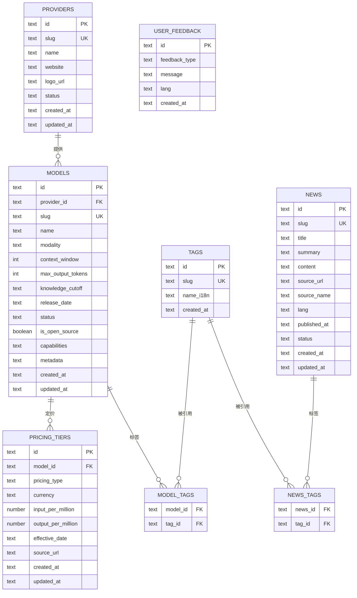

# Database Design — Cloudflare D1 (SQLite)

AI Model Intelligence Platform 的数据模型设计。Phase 1 为设计基线，Phase 5 落地 DDL 与迁移。

## 1. 设计原则

| 原则 | 约定 |
| --- | --- |
| 主键 | `TEXT` + ULID（跨实例安全、避免自增瓶颈、可排序） |
| 时间戳 | `TEXT` ISO 8601 UTC（`2026-08-01T00:00:00Z`） |
| 金额 | 统一以 **USD** 存储（`NUMBER`）；展示层按语言/地区换算 |
| 灵活字段 | 能力标签、多语言名称等使用 JSON 文本（`TEXT`） |
| 软状态 | 数据行用 `status` 字段（active/deprecated/draft），不物理删除业务数据 |
| 命名 | 表名复数 snake_case；字段 snake_case |

## 2. ER 总览

## 3. 表设计

### 3.1 providers — AI 供应商

| 字段 | 类型 | 说明 |
| --- | --- | --- |
| id | TEXT PK | ULID |
| slug | TEXT UK | 唯一标识，如 `openai` |
| name | TEXT | 供应商名（默认英文） |
| website | TEXT | 官网 |
| logo_url | TEXT | Logo 地址 |
| status | TEXT | active / deprecated |
| created_at / updated_at | TEXT | 时间戳 |

### 3.2 models — 模型目录

| 字段 | 类型 | 说明 |
| --- | --- | --- |
| id | TEXT PK | ULID |
| provider_id | TEXT FK | 所属供应商 |
| slug | TEXT UK | 唯一标识，如 `gpt-4o`（供应商内唯一：`{provider_slug}/{model_slug}` 全局唯一） |
| name | TEXT | 展示名 |
| modality | TEXT | chat / embedding / image / audio / vision… |
| context_window | INTEGER | 上下文窗口（tokens） |
| max_output_tokens | INTEGER | 最大输出 tokens |
| knowledge_cutoff | TEXT | 知识截止日期 |
| release_date | TEXT | 发布日期 |
| status | TEXT | active / deprecated |
| is_open_source | INTEGER | 是否开源 |
| capabilities | TEXT(JSON) | 能力列表，如 `["vision","function_calling","json_mode"]` |
| metadata | TEXT(JSON) | 预留扩展（供应商特有字段） |

### 3.3 pricing_tiers — 模型价格

| 字段 | 类型 | 说明 |
| --- | --- | --- |
| id | TEXT PK | ULID |
| model_id | TEXT FK | 模型 |
| pricing_type | TEXT | `standard` / `batch` / `cache_read` / `cache_write`（预留多级定价） |
| currency | TEXT | 默认 `USD` |
| input_per_million | NUMBER | 每 1M input tokens 单价 |
| output_per_million | NUMBER | 每 1M output tokens 单价 |
| effective_date | TEXT | 生效日期（支持价格历史） |
| source_url | TEXT | 数据来源链接（**数据透明**） |
| created_at / updated_at | TEXT | 时间戳 |

> 唯一约束：`(model_id, pricing_type, effective_date)`。

### 3.4 tags / model_tags / news_tags — 标签体系

| 表 | 字段 | 说明 |
| --- | --- | --- |
| tags | slug UK, name_i18n(JSON) | 标签名支持多语言（`{"en":"Reasoning","zh-CN":"推理"}`） |
| model_tags | model_id + tag_id | 模型-标签关联（复合主键） |
| news_tags | news_id + tag_id | 资讯-标签关联 |

### 3.5 news — AI 行业资讯

| 字段 | 类型 | 说明 |
| --- | --- | --- |
| id | TEXT PK | ULID |
| slug | TEXT UK | 唯一标识 |
| title / summary / content | TEXT | 内容 |
| source_url / source_name | TEXT | 原文链接与来源（透明归因） |
| lang | TEXT | 语言（`en`/`zh-CN`/…） |
| published_at | TEXT | 发布时间 |
| status | TEXT | draft / published |
| created_at / updated_at | TEXT | 时间戳 |

### 3.6 user_feedback — 匿名反馈

| 字段 | 类型 | 说明 |
| --- | --- | --- |
| id | TEXT PK | ULID |
| feedback_type | TEXT | model_missing / price_incorrect / other |
| message | TEXT | 反馈内容 |
| lang | TEXT | 用户语言 |
| created_at | TEXT | 时间戳 |

> 不收集任何个人信息（产品理念：开放、透明、隐私友好）。

## 4. 索引规划

| 表 | 索引 | 目的 |
| --- | --- | --- |
| models | (provider_id, slug) | 供应商模型列表 |
| models | (status, modality) | 目录筛选 |
| pricing_tiers | (model_id, effective_date DESC) | 当前价格查询 |
| news | (lang, published_at DESC) | 资讯流 |
| news | (status) | 发布过滤 |

## 5. 数据同步策略（与内容层一致性）

- **静态源**：模型/价格/资讯的"事实源"在 git 内 content collections（可审查、透明、免费托管）。
- **同步**：构建/部署流程通过 seed 脚本将 collections 写入 D1（幂等 upsert），Worker API 读 D1 返回同一口径数据。
- **价格历史**：pricing_tiers 保留多版本（effective_date），前端默认展示最新，未来支持趋势。

## 6. 迁移策略

- Phase 5 起使用 `wrangler d1 migrations`：`database/migrations/` 按序编号 `0001_xxx.sql`。
- `database/schema/schema.sql` 维护"最新全量 schema"，与迁移序列保持最终一致。
